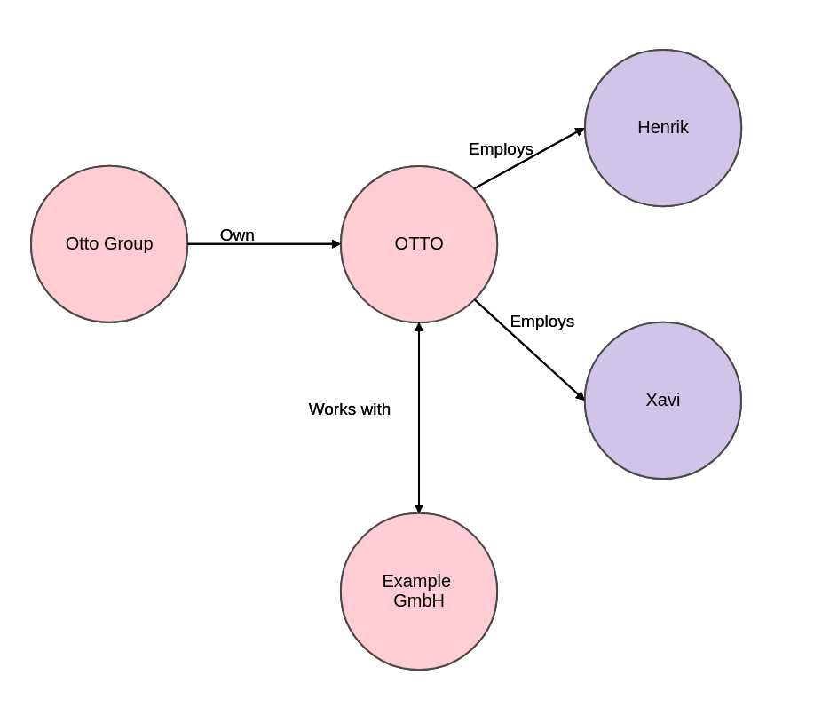
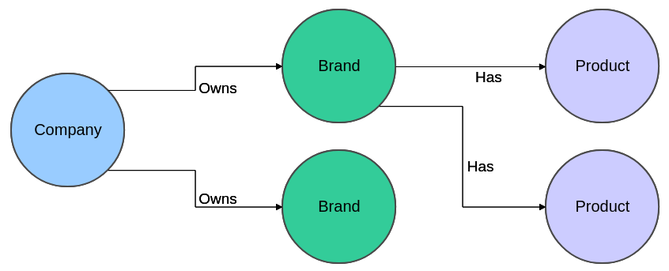

## Implementing a GraphQL API  using AWS AppSync

Henrik Horeis and Xavier Alvarez

Note:
* Mute microphone
* Questions at the end
* We will share github link so you can have a look yourself

---

## Key concepts

---

### What is GraphQL?

* It's a query language for APIs.
* Created by Facebook in 2012, open sourced in 2015.
* It gives clients the power to ask for exactly what they need and nothing more.
* Used by big tech players such as GitHub, Twitter or PayPal.

Source: [https://graphql.org/][1]

[1]: https://graphql.org/

---

### What is GraphQL?

---

### What is AWS AppSync?

* AWS AppSync is a fully managed service that makes it easy to develop GraphQL APIs.
* It supports multiple data sources such as DynamoDB, RDS, ElasticSearch, Lambda or HTTP endpoints.

Source: [https://aws.amazon.com/appsync/][2]

[2]: https://aws.amazon.com/appsync/

---

### Use Case

* Get specific Company attributes.
* Get all Products from a certain Brand.
* Change availability of a specific Product.

---

## Live Demo

Note:
* Explain that repo contains terraform script but now we'll show
it slowly using UI.
* Companies
  * Create Companies Table
  * Create AppSync API, Data Source, Schema, mutation and query Resolver.
  * Call API using UI.
* Products and Brands.
  * Create Products and Brands tables
  * Create Data Sources,
  * Create types
  * Add "create" mutations
  * Add "getProductsByBrand" query resolver.
  * Add "updateProductAvailability" mutation resolver.
* Call API using Insomnia.

---

### Conclusion

* It excels with the right data.
* Fast growing technology.
* Clients must support GraphQL.
* AppSync might be cumbersome for some use cases.

Note:
* New spring-graphql project (July 2021).

---

# Q & A

https://github.com/xalvarez/aws-graphql-workshop

